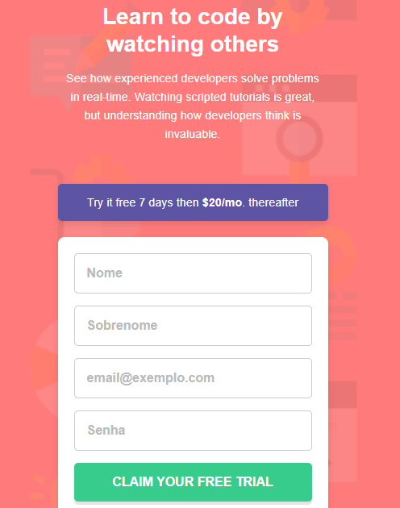
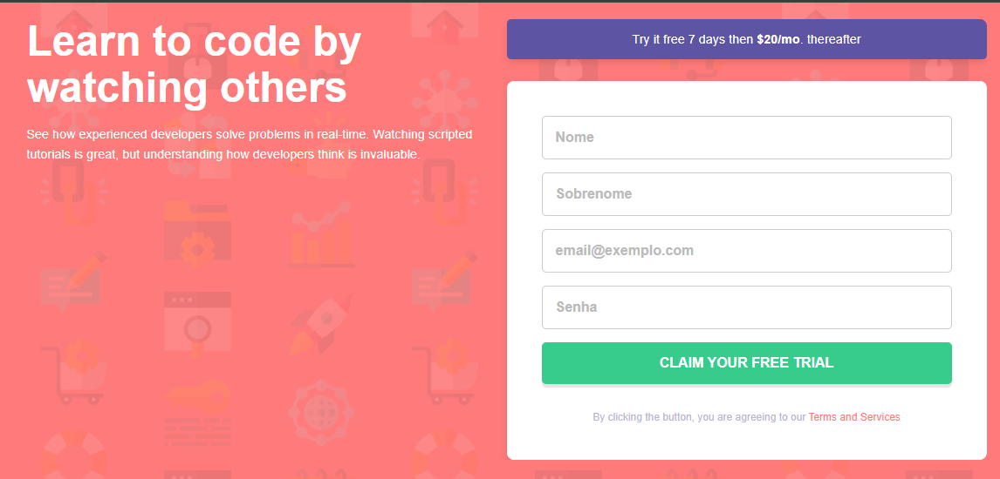

## Sumario

- [Visão Geral](#Visão-Geral)
  - [O Desafio](#o-desafio)
  - [Capturas de tela](#Capturas-de-tela)
  - [Links](#links)
- [Meu Processo](#meu-processo)
  - [Construído com](#Construído-com)
  - [O que aprendi](#O-que-aprendi)
  - [Desenvolvimento contínuo](#Desenvolvimento-contínuo)
  - [Recursos úteis](#Recursos-úteis)
- [Autor](#autor)
- [Agradecimentos](#Agradecimentos)

## Visão Geral

### O desafio

Os usuários devem ser capazes de:
- Ver o layout ideal do site dependendo do tamanho da tela do dispositivo.
- Ver os estados de "hover" para todos os elementos interativos na página.
- Receber uma mensagem de erro quando o formulário for enviado se:
- Qualquer campo input estiver vazio. A mensagem para este erro deve dizer "[Nome do Campo] não pode estar vazio".
- O endereço de e-mail não estiver formatado corretamente (ou seja, um endereço de e-mail correto deve ter esta estrutura: nome@host.tld). A mensagem para este erro deve dizer "Parece que este não é um email".

### Capturas de tela




### Links

- URL da Solução: (https://github.com/jamyssonsamuel)
- Live Site URL: ()

## Meu Processo

### Construído com

- Marcação HTML5 semântica
- Propriedades customizadas CSS
- Flexbox
- Fluxo de trabalho Mobile-first
- JavaScript Vanilla


### O que aprendi

Neste projeto, reforcei a importância do workflow mobile-first para construir layouts responsivos de forma eficiente. O principal desafio foi a validação do formulário com JavaScript. Tive a oportunidade de aplicar a lógica para:
- Interromper o envio padrão do formulário com `event.preventDefault()`.
- Iterar sobre os campos de entrada (input) e verificar se estão vazios ou se o formato do e-mail é válido.
- Manipular classes CSS (por exemplo, `.inputs.error`) para exibir ou ocultar mensagens de erro e ícones.
- Limpar os valores dos campos de entrada que falharam na validação com `input.value = ''`.
- Um ponto de aprendizado crucial foi a necessidade de ter os elementos de erro (como <span class="error-msg">) presentes no HTML para que o JavaScript possa manipulá-los, evitando erros de referência (TypeError).

```JavaScript
// Exemplo do código de validação que me deu mais trabalho,
// mas que me ensinou bastante!
inputs.forEach(input => {
    // ...
    if (inputValue === '') {
        parentElement.classList.add('error');
        errorMessage.textContent = `${inputName.charAt(0).toUpperCase() + inputName.slice(1)} não pode estar vazio`;
        input.value = '';
    } else if (inputName === 'email') {
        const emailRegex = /^[^\s@]+@[^\s@]+\.[^\s@]+$/;
        if (!emailRegex.test(inputValue)) {
            parentElement.classList.add('error');
            errorMessage.textContent = 'Parece que este não é um email';
            input.value = '';
        }
    }
});
```

### Desenvolvimento contínuo

Pretendo focar em aprofundar meus conhecimentos em:

- Testes de Software, para garantir a qualidade e a funcionalidade de um projeto do início ao fim.
- Integração de JavaScript com APIs, para criar aplicações mais dinâmicas e interativas.
- Práticas de Engenharia de Software, para estruturar melhor meus projetos e garantir que sejam escaláveis e de fácil manutenção.

## Autor

- GitHub - [@jamyssonsamuel](https://github.com/jamyssonsamuel)
- Frontend Mentor - [@jamyssonsamuel](https://www.frontendmentor.io/profile/jamyssonsamuel)

## Agradecimentos

Gostaria de agradecer ao Frontend Mentor por fornecer este desafio de codificação prático e bem estruturado, que me permitiu aplicar e consolidar meus conhecimentos em HTML5, CSS3 e JavaScript. Gostaria de agradecer também a ajuda do meu orientador virtual, Shikamaru, que me auxiliou na resolução dos problemas do JavaScript e na elaboração deste README. Seu apoio foi fundamental para a conclusão do projeto.
